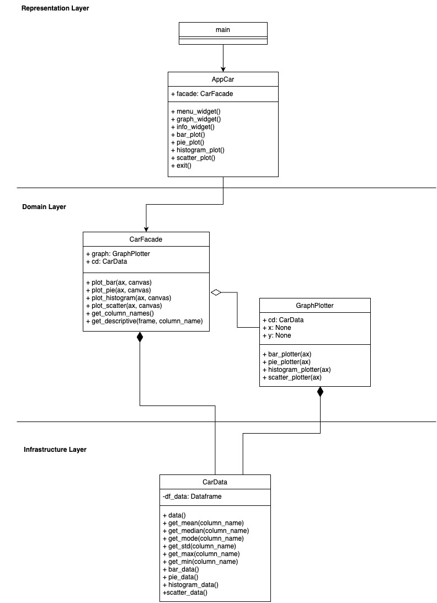
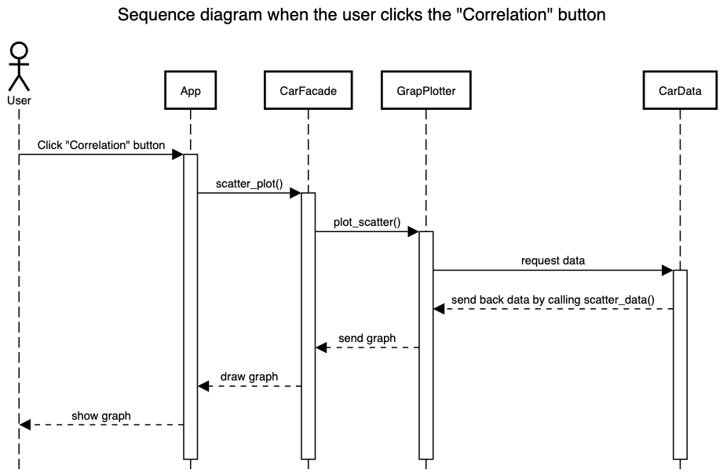

# Sport Car Analysis

## Description

Sport Car Analysis is an application that shows different graphs, including
everyday graphs (time series, part-to-whole), distribution graphs, and
correlations.

## Data Sources

Sport Car Analysis uses dataset from sport_car_data.csv and this source is
from: https://www.kaggle.com/datasets/rkiattisak/sports-car-prices-dataset

## Running the Application

Open a command-line interface
  - MacOS or Linux: Open the Terminal.
  - Windows: Open the Command Prompt, PowerShell, or Windows Terminal, depending on which you prefer.

Check Python is installed
  ```bash
  python --version
  ```
  > If Python is installed, it should show the version.

Clone the repository from GitHub
  ```bash
  git clone https://github.com/xNatthapol/ku-polls.git
  ```

Change the directory to the ku-polls project
  ```bash
  cd ku-polls
  ```

Create a Virtual Environment
  ```bash
  python -m venv venv
  ```

Activate the Virtual Environment
- On MacOS or Linux
    ```bash
    source venv/bin/activate
    ```
- On Windows
    ```cmd
    venv\Scripts\activate
    ```

Before running the application, users need to install dependencies:

```bash
pip install -r requirements.txt
```

After installing the packages, users can run the application by  
running: ```main.py```

## Design

Here is my uml class diagram:

Here is my sequence diagram:


In this application, we have 4 classes:

- ```App``` is a class that used to provides a user interface for users to view
  graphs.
- ```CarFacade``` is a class that used to manage many methods, organize them,
  and export them to the GUI.
- ```GraphPlotter``` is a class that used to analysis data and create a graph.
- ```CarData``` is a class that used to read data from a csv file and send it
  to other classes.

## Design Patterns Used

In this application, I used the ```Facade``` design pattern that used to manage
many
methods, organize them, and export them to the GUI.

## Graph Algorithm Used

In this project, we use graph algorithms to count car models from the
relationships between different car models of the same make. We want to show
the number of car models that have the same make by using the ComponentCount
algorithm to find the number of connected components in an undirected graph.

## Other Information

Through this project, I learned new things and got better at using Pandas,
Tkinter, and Matplotlib.
